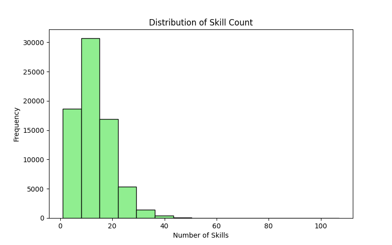

# Recruitment Pipeline Analysis

This project provides a comprehensive analysis of recruitment trends using various datasets. By leveraging Python for data cleaning and exploratory data analysis, and Tableau for visualizations, this project highlights key findings regarding education, employment, and salary trends. The insights are intended to assist HR teams and stakeholders in optimizing recruitment strategies.

## Table of Contents
1. [Project Overview](#project-overview)
2. [Data Analysis Process](#data-analysis-process)
3. [Key Findings](#key-findings)
4. [Visualizations](#visualizations)

---

## Project Overview

The **Recruitment Pipeline Analysis** explores trends in the employment landscape based on factors such as education level, skills, and gender. The objective is to provide actionable insights into:
- Employment rates by education level and country.
- Common skills among candidates.
- Salary distributions across demographics.

**Key Tools Used:**
- **Python:** Data cleaning, processing, and EDA.
- **Tableau:** Visualization of trends and insights.
- **Matplotlib/Seaborn:** Complementary exploratory graphs.

---

## Data Analysis Process

### 1. Data Cleaning
The dataset contained 73,462 rows and 15 columns, with minimal missing values. Null values in the `HaveWorkedWith` column were filled with "Unknown" for consistency.

### 2. Exploratory Data Analysis
The EDA examined key variables, including:
- `EdLevel` (Education Level)
- `Employment` (Employment Status)
- `Gender`
- `HaveWorkedWith` (Skills)
- `PreviousSalary`

Insights were extracted using Python scripts for group-level analysis, such as average skill counts by education and salary comparisons across genders.

---

## Key Findings

### Employment Rate by Education Level
- **No Higher Education** and **Other** categories had the highest employment rates (~59%).
- **PhD holders** had the lowest employment rate (~28.6%).

### Skills
- The average skill count per candidate was **13.43**.
- Popular skills:
  - **JavaScript:** 49,347 mentions
  - **Docker:** 40,224 mentions
  - **HTML/CSS:** 40,207 mentions

### Salary Trends
- PhD holders earned the highest average salary (~$98,151.61), while those with no higher education averaged ~$55,546.74.
- **Gender Pay Gaps:** Significant disparities observed, with **women** earning on average less than **men** and **non-binary individuals**.

---

## Visualizations

The following visualizations were created to support the analysis:

1. **Employment Rate by Education Level:**
   
<noscript></noscript><object class='tableauViz'  style='display:none;'><param name='host_url' value='https%3A%2F%2Fpublic.tableau.com%2F' /> <param name='embed_code_version' value='3' /> <param name='site_root' value='' /><param name='name' value='employment_rate_by_edlevel&#47;EmploymentRatebyEducationLevel' /><param name='tabs' value='no' /><param name='toolbar' value='yes' /><param name='static_image' value='https:&#47;&#47;public.tableau.com&#47;static&#47;images&#47;em&#47;employment_rate_by_edlevel&#47;EmploymentRatebyEducationLevel&#47;1.png' /> <param name='animate_transition' value='yes' /><param name='display_static_image' value='yes' /><param name='display_spinner' value='yes' /><param name='display_overlay' value='yes' /><param name='display_count' value='yes' /><param name='language' value='en-US' /><param name='filter' value='publish=yes' /></object>

2. **Top 10 Countries by Employment Rate:**
   
<noscript></noscript><object class='tableauViz'  style='display:none;'><param name='host_url' value='https%3A%2F%2Fpublic.tableau.com%2F' /> <param name='embed_code_version' value='3' /> <param name='site_root' value='' /><param name='name' value='Top_10_Countries_17376806384170&#47;Top10CountriesbyAverageEmploymentRate' /><param name='tabs' value='no' /><param name='toolbar' value='yes' /><param name='static_image' value='https:&#47;&#47;public.tableau.com&#47;static&#47;images&#47;To&#47;Top_10_Countries_17376806384170&#47;Top10CountriesbyAverageEmploymentRate&#47;1.png' /> <param name='animate_transition' value='yes' /><param name='display_static_image' value='yes' /><param name='display_spinner' value='yes' /><param name='display_overlay' value='yes' /><param name='display_count' value='yes' /><param name='language' value='en-US' /><param name='filter' value='publish=yes' /></object>
        

3. **Average Salary by Education Level:**
   
<noscript></noscript><object class='tableauViz'  style='display:none;'><param name='host_url' value='https%3A%2F%2Fpublic.tableau.com%2F' /> <param name='embed_code_version' value='3' /> <param name='site_root' value='' /><param name='name' value='Salary_by_Ed_Level&#47;SalarybyEducationLevel' /><param name='tabs' value='no' /><param name='toolbar' value='yes' /><param name='static_image' value='https:&#47;&#47;public.tableau.com&#47;static&#47;images&#47;Sa&#47;Salary_by_Ed_Level&#47;SalarybyEducationLevel&#47;1.png' /> <param name='animate_transition' value='yes' /><param name='display_static_image' value='yes' /><param name='display_spinner' value='yes' /><param name='display_overlay' value='yes' /><param name='display_count' value='yes' /><param name='language' value='en-US' /><param name='filter' value='publish=yes' /></object>

4. **Salary Distribution by Gender:**
   
<noscript></noscript><object class='tableauViz'  style='display:none;'><param name='host_url' value='https%3A%2F%2Fpublic.tableau.com%2F' /> <param name='embed_code_version' value='3' /> <param name='site_root' value='' /><param name='name' value='Salary_Distribution_by_Gender&#47;AverageSalarybyGender' /><param name='tabs' value='no' /><param name='toolbar' value='yes' /><param name='static_image' value='https:&#47;&#47;public.tableau.com&#47;static&#47;images&#47;Sa&#47;Salary_Distribution_by_Gender&#47;AverageSalarybyGender&#47;1.png' /> <param name='animate_transition' value='yes' /><param name='display_static_image' value='yes' /><param name='display_spinner' value='yes' /><param name='display_overlay' value='yes' /><param name='display_count' value='yes' /><param name='language' value='en-US' /><param name='filter' value='publish=yes' /></object>

5. **Skill Count Distribution:**
   

## Embedded Tableau Dashboard

<noscript></noscript><object class='tableauViz'  style='display:none;'><param name='host_url' value='https%3A%2F%2Fpublic.tableau.com%2F' /> <param name='embed_code_version' value='3' /> <param name='site_root' value='' /><param name='name' value='Recruitment_Analysis_Pipeline&#47;RecruitmentPipelineAnalysis' /><param name='tabs' value='no' /><param name='toolbar' value='yes' /><param name='static_image' value='https:&#47;&#47;public.tableau.com&#47;static&#47;images&#47;Re&#47;Recruitment_Analysis_Pipeline&#47;RecruitmentPipelineAnalysis&#47;1.png' /> <param name='animate_transition' value='yes' /><param name='display_static_image' value='yes' /><param name='display_spinner' value='yes' /><param name='display_overlay' value='yes' /><param name='display_count' value='yes' /><param name='language' value='en-US' /><param name='filter' value='publish=yes' /></object>

This analysis serves as a foundation for understanding recruitment trends and identifying areas for improvement. Contributions and feedback are welcome to improve its insights!
